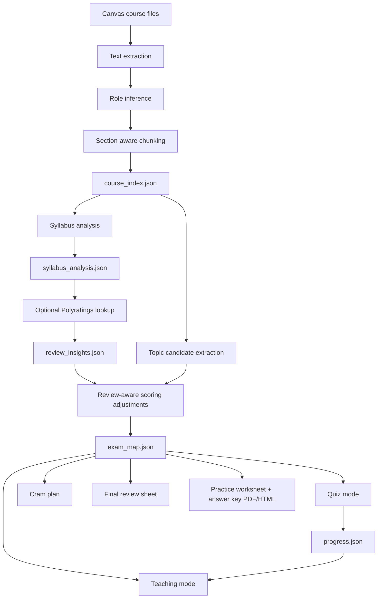

# Agent Architecture

## Deliverable 1: Architecture

The agent has five layers:

1. **Source layer**
   - Input: a local Canvas course folder.
   - Supported files: `.txt`, `.md`, `.csv`, `.tsv`, `.json`, `.html`, `.docx`, `.pptx`, `.xlsx`, and extractable `.pdf`.

2. **Index layer**
   - Walks the folder recursively.
   - Extracts text.
   - Infers document role from file/folder names.
   - Splits content into chunks with section labels.
   - Runs syllabus-first extraction when a syllabus is present.
   - Stores structured evidence in `course_index.json`.

3. **Syllabus and review strategy layer**
   - Extracts course code, course name, instructor, grading breakdown, exam weighting, learning objectives, important topics, and exam guidance.
   - Uses the extracted instructor/course metadata to optionally fetch Polyratings professor/course reviews.
   - Summarizes student-reported study strategies, exam patterns, difficult topics, time-management advice, and pitfalls.
   - Labels review insights by reliability and stores them in `review_insights.json`.

4. **Exam-likelihood layer**
   - Extracts candidate topics from headings, objectives, emphasized lines, and repeated phrases.
   - Scores topics using course evidence.
   - Applies modest ranking adjustments only for recurring student-reported review patterns.
   - Stores ranked topics in `exam_map.json`.

5. **Tutoring layer**
   - Teaches one topic at a time.
   - Includes explanation, core ideas, likely question styles, worked-example patterns, traps, quiz, spaced repetition, and citations.
   - Adapts the teaching frame for quantitative, reading-heavy, or mixed courses.
   - Includes a `Professor & Course Strategy Insights` section with separated evidence sources.

6. **Practice export layer**
   - Generates worksheet-style practice exams and topic-specific problem sets from the highest-priority topics.
   - Exports a clean student worksheet and a separate answer key.
   - Supports PDF and HTML outputs.
   - Uses quantitative templates for calculation-heavy topics and conceptual templates for definition, comparison, and short-answer topics.

7. **Progress layer**
   - Tracks covered topics.
   - Stores interactive quiz history.
   - Maintains weak-topic estimates in `progress.json`.

## Data Flow



## Deliverable 2: Ranking Logic

Each topic receives a weighted score from these signals:

- **Document role**
  - Practice or past exam: strongest signal.
  - Exam review and study guide: very strong signal.
  - Quiz, homework, assignment: strong signal.
  - Lecture slides and notes: medium signal.
  - Readings and discussion: lower signal unless repeated or emphasized.

- **Repetition**
  - Topics repeated across multiple files receive a repeat bonus.
  - Repetition across different document roles is more valuable than repetition inside one file.

- **Instructional intent**
  - Learning objectives, “be able to,” and “students will understand” raise likelihood.

- **Instructor emphasis**
  - Phrases like “important,” “know this,” “exam,” “focus on,” and “must know” raise likelihood.

- **Assessment proximity**
  - Homework, quiz, practice problem, sample question, and worked-example language raises likelihood.

- **Structure**
  - Headings, summary sections, review sections, and recap sections raise likelihood.

- **Syllabus**
  - Exam weighting, grading breakdown, stated learning objectives, explicit important topics, and exam guidance raise priority when tied to actual course concepts.

- **Student reviews**
  - Recurring Polyratings patterns can modestly adjust priority. For example, repeated reports that exams follow homework can boost assignment/problem-set topics.
  - Isolated or extreme reviews are downweighted.
  - Review insights are always marked as student-reported rather than verified facts.

The output labels each topic as:

- `very likely exam material`
- `possibly testable material`
- `low-priority material`

Confidence is based on source count, review/practice evidence, learning-objective language, and emphasis language.

## Deliverable 4: Reading And Chunking

The indexer creates one chunk per coherent section when possible:

- Heading-like lines update the current section label.
- Long sections are split around a target size.
- Each chunk stores:
  - chunk ID
  - relative file path
  - file name
  - inferred file role
  - section label
  - text
  - word count
  - signal counts

This lets the tutor cite evidence like:

```text
Lecture_05_Slides.pptx :: Elasticity And Revenue (heading, formula)
Final_Review.md :: Unit 3 Review (learning objective, emphasis)
```

## Course-Type Adaptation

The agent detects rough course type from course language:

- **Quantitative**
  - More formulas, calculations, equations, derivations, graphs, and problem-solving terms.
  - Teaching emphasizes formulas, variables, worked solution patterns, and calculation traps.

- **Reading-heavy**
  - More essay, argument, evidence, theme, author, define, compare, and contrast language.
  - Teaching emphasizes definitions, arguments, themes, comparisons, and essay prompts.

- **Mixed**
  - Uses both conceptual and applied tutoring patterns.

## Current Limits

- The deterministic version does not deeply understand diagrams, images, handwritten notes, or scanned PDFs without OCR.
- PDF support depends on `pypdf`, `PyPDF2`, or `pdftotext`.
- Topic extraction is heuristic. It works best when file names, headings, review sheets, and assignments are descriptive.
- Polyratings lookup depends on internet access and a reliable professor match from the syllabus. If no match or no reviews are found, the system continues from syllabus/material evidence only.
- The included prompts can be used with an LLM to add richer conversational teaching over the same index and exam map.
